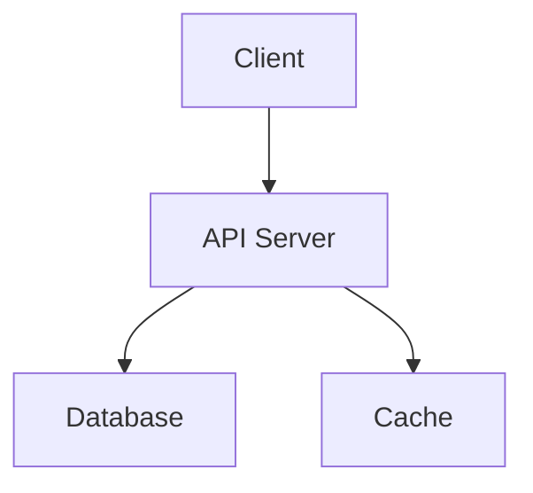

# README.md Best Practices & Standards (2025-2026)

> A comprehensive guide to creating world-class README files that serve both humans and AI systems effectively.

---

## Table of Contents

- [Core Principles](#core-principles)
- [Required Structure (Standard Readme Spec)](#required-structure-standard-readme-spec)
- [Modern Best Practices (2025-2026)](#modern-best-practices-2025-2026)
- [Accessibility Standards](#accessibility-standards)
- [AI/LLM-Friendly Documentation](#aillm-friendly-documentation)
- [Project-Specific Guidelines](#project-specific-guidelines)
- [Common Mistakes to Avoid](#common-mistakes-to-avoid)
- [Tools & Resources](#tools--resources)
- [GitHub-Specific Requirements](#github-specific-requirements)
- [Templates & Examples](#templates--examples)
- [Measuring README Quality](#measuring-readme-quality)
- [References](#references)

---

## Core Principles

### The 60-Second Rule

A good README must answer four questions in under 60 seconds:

1. **What does this do?** - Clear, concise description of purpose
2. **How do I install it?** - Copy-pasteable installation commands
3. **How do I use it?** - Working code example with expected output
4. **Should I trust it?** - License, maintainers, badges, activity signals

If your README can't answer all four in under 60 seconds of reading, you've lost the reader. Most developers have a dozen browser tabs open and a task list that's already too long.

### Cognitive Funneling

Arrange information wide-to-narrow so readers can decide quickly whether to invest more time. Let them short-circuit exit at any point:

- **Wide**: Title, badges, one-line description (5 seconds)
- **Medium**: Quick install, usage example (20 seconds)
- **Narrow**: Detailed API, configuration, contributing (35+ seconds)

This pattern respects the reader's time and allows them to bail early if the project isn't a fit.

### Brevity

The ideal README is as short as it can be without being any shorter. Detailed documentation belongs in separate files, not the README.

- README is a landing page, not documentation
- Link to dedicated docs for deep dives
- Keep under 200 lines when possible
- Use collapsible sections for optional details

### The Documentation-Not-Code Principle

> "Your documentation is complete when someone can use your module without ever having to look at its code." — Ken Williams

The documentation, not the code, defines what a module does. This separation allows you to change internals freely as long as the interface remains stable.

---

## Required Structure (Standard Readme Spec)

The [Standard Readme Specification](https://github.com/RichardLitt/standard-readme) provides a well-defined structure for README files. Sections must appear in the order listed below.

### 1. Title (Required)

**Requirements:**
- Title must match repository, folder, and package manager names
- Or include alternative title with actual name in italics in parentheses
- Example: `# Standard Readme Style _(standard-readme)_`

**If names don't match:** Must include a note in the Long Description section explaining why.

**Suggestions:**
- Should be self-evident
- Use the project's actual name, not a slogan or tagline

### 2. Banner (Optional)

**Requirements:**
- Must not have its own title
- Must link to local image in current repository
- Must appear directly after the title

**Use case:** Project logos or hero images that establish visual identity.

### 3. Badges (Optional)

**Requirements:**
- Must not have its own title
- Must be newline-delimited

**Suggestions:**
- Use [shields.io](https://shields.io) or similar services
- For static badges, consider locally hosted images to avoid external requests/tracking
- Add the [Standard Readme badge](https://github.com/RichardLitt/standard-readme#badge) if compliant

**Recommended badges (max 3-4):**
- Build status (CI/CD)
- Package version (npm, PyPI, etc.)
- License
- Documentation status
- Coverage (if impressive)

**Avoid:** Decorative badges that add noise without conveying useful information.

### 4. Short Description (Required)

**Requirements:**
- Less than 120 characters
- Must not start with `> `
- Must be on its own line
- Must match the description in the package manager's `description` field
- Must match GitHub's repository description (if on GitHub)

**Suggestions:**
- Use action verbs: "Converts markdown to HTML" not "A tool that converts..."
- Avoid "this project is..." or "my-project is a tool that helps you..."
- Focus on what it does, not what it's made of
- Use [gh-description](https://github.com/RichardLitt/gh-description) to sync with GitHub
- Use `npm show . description` to check npm package description

**Examples:**
- Good: "Fast, minimal CLI tool for converting markdown files to HTML"
- Bad: "This is a project that helps you convert markdown files to HTML"

### 5. Long Description (Optional)

**Requirements:**
- Must not have its own title
- If names don't match, explain why here (see Title section)

**Suggestions:**
- If too long, consider moving to Background section
- Cover the main reasons for building the repository
- Keep it to 2-3 paragraphs maximum
- Quote from [perlmodstyle](http://perldoc.perl.org/perlmodstyle.html):

> "This should describe your module in broad terms, generally in just a few paragraphs; more detail of the module's routines or methods, lengthy code examples, or other in-depth material should be given in subsequent sections. Ideally, someone who's slightly familiar with your module should be able to refresh their memory without hitting 'page down'. As your reader continues through the document, they should receive a progressively greater amount of knowledge."

### 6. Table of Contents (Required for READMEs >100 lines)

**Requirements:**
- Must link to all sections in the file
- Must start with the next section (exclude title and ToC headings)
- Must be at least one-depth (capture all `##` headings)
- Optional for READMEs shorter than 100 lines

**Suggestions:**
- May capture third and fourth depth headings for long ToCs
- GitHub auto-generates ToC from headings (click "Outline" icon), but manual ToC gives more control

**Example:**
```markdown
- [Install](#install)
- [Usage](#usage)
- [API](#api)
- [Contributing](#contributing)
- [License](#license)
```

### 7. Security (Optional)

**Status:** May go here if critical; otherwise in Extra Sections.

**Requirements:** None specific

**Suggestions:**
- Highlight security concerns prominently if they affect adoption
- Include vulnerability reporting process
- Link to SECURITY.md if it exists
- Mention any security-related dependencies or considerations

### 8. Background (Optional)

**Requirements:**
- Cover motivation
- Cover abstract dependencies
- Cover intellectual provenance (a "See Also" section is fitting)

**Suggestions:**
- Explain why this project exists
- What problem does it solve?
- What alternatives exist and why this approach?
- Historical context or inspiration

### 9. Install (Required, except for documentation repos)

**Requirements:**
- Code block illustrating how to install

**Subsections:**
- `Dependencies` - Required if there are unusual dependencies or dependencies that must be manually installed

**Suggestions:**
- Link to prerequisite sites (npmjs, godocs, etc.)
- Include system-specific information if needed
- Separate local development setup from end-user installation if they differ
- An `Updating` section is useful for packages with multiple versions

**Example:**
```markdown
## Install

```bash
npm install your-package
```

### Dependencies

- Node.js 18 or higher
- Python 3.10 or higher (for build scripts)
```

### 10. Usage (Required, except for documentation repos)

**Requirements:**
- Code block illustrating common usage
- If CLI compatible: code block indicating common CLI usage
- If importable: code block indicating both import functionality and usage

**Subsections:**
- `CLI` - Required if CLI functionality exists

**Suggestions:**
- Cover basic choices that may affect usage (promises/callbacks, ES6, etc.)
- Show the simplest possible example that demonstrates value
- Include expected output so users can verify it works
- If API is large, pick the 20% that covers 80% of use cases
- Link to runnable file or external examples for complex usage

**Example:**
```markdown
## Usage

```javascript
import { convert } from 'your-package';

const result = convert('# Hello', 'html');
console.log(result); // <h1>Hello</h1>
```

### CLI

```bash
your-package convert input.md --output output.html
```

### 11. Extra Sections (Optional)

**Requirements:** None

**Suggestions:**
- This should not be called "Extra Sections" in the actual README
- This is a space for 0 or more custom sections
- Place after Usage, before API
- Security section can go here if not placed earlier
- Common extra sections: Features, Configuration, Troubleshooting, FAQ

### 12. API (Optional)

**Requirements:**
- Describe exported functions and objects

**Suggestions:**
- Describe signatures, return types, callbacks, and events
- Cover types where not obvious
- Describe caveats and edge cases
- If using external API generator (js-doc, go-doc, etc.), point to external `API.md`
- Tables work well for API documentation

**Example:**
```markdown
## API

| Function | Parameters | Returns | Description |
|----------|------------|---------|-------------|
| `convert()` | `input: string, format: string` | `string` | Converts input to specified format |
| `validate()` | `input: string` | `boolean` | Validates input syntax |
```

### 13. Maintainer(s) (Optional)

**Requirements:**
- Must be called "Maintainer" or "Maintainers"
- List maintainer(s) with one way to contact them (GitHub link or email)

**Suggestions:**
- Should be a small list of people in charge
- Not everyone with access rights (e.g., not entire organization)
- Listing past maintainers is good for attribution and kindness

**Example:**
```markdown
## Maintainers

- [@username](https://github.com/username) - John Doe
- Jane Smith <jane@example.com>
```

### 14. Thanks/Credits/Acknowledgements (Optional)

**Requirements:**
- Must be called "Thanks", "Credits", or "Acknowledgements"

**Suggestions:**
- State anyone/anything that significantly helped with development
- Include public contact hyperlinks if applicable
- Credit embedded resources (icons, fonts, photos) with their licenses

**Example:**
```markdown
## Thanks

Special thanks to:
- [@contributor](https://github.com/contributor) for the feature implementation
- The [Awesome Project](https://example.com) team for inspiration
```

### 15. Contributing (Required)

**Requirements:**
- State where users can ask questions
- State whether PRs are accepted
- List any requirements for contributing (e.g., commit sign-off)

**Suggestions:**
- Link to CONTRIBUTING.md if it exists
- Be as friendly as possible
- Link to GitHub issues
- Link to Code of Conduct
- Include a subsection for listing contributors
- Provide clear steps for opening PRs

**Example:**
```markdown
## Contributing

Contributions are welcome! Please:

1. Fork the repository
2. Create a feature branch (`git checkout -b feature/amazing-feature`)
3. Commit your changes (`git commit -m 'Add amazing feature'`)
4. Push to the branch (`git push origin feature/amazing-feature`)
5. Open a Pull Request

Please follow our [Code of Conduct](CODE_OF_CONDUCT.md).

For questions, please [open an issue](https://github.com/user/repo/issues).
```

### 16. License (Required, must be last section)

**Requirements:**
- State license full name or SPDX identifier from [SPDX license list](https://spdx.org/licenses/)
- For unlicensed repositories: use `UNLICENSED`
- For more details: use `SEE LICENSE IN <filename>` and link to license file
- State license owner
- Must be the last section

**Suggestions:**
- Link to longer license file in local repository
- Include reuse constraints if applicable

**Example:**
```markdown
## License

MIT © [Your Name](https://github.com/yourname) - see [LICENSE](LICENSE) file for details
```

---

## Modern Best Practices (2025-2026)

### Visual Elements

#### Mermaid Diagrams
Mermaid diagrams render natively on GitHub and provide architecture visualizations without external image files.

**Example:**
```markdown
## Architecture


```

**Benefits:**
- Lives in the README, no external dependencies
- Updates when markdown updates
- Renders on GitHub, GitLab, and Mermaid-aware viewers
- Perfect for showing system architecture, data flow, component relationships

#### Terminal GIFs with vhs
For CLI tools, terminal GIFs demonstrate usage effectively. The [vhs](https://github.com/charmbracelet/vhs) tool automates recording.

**Example:**
```markdown
## Demo


```

**vhs workflow:**
1. Create `.tape` file with terminal commands
2. Run `vhs demo.tape` to generate GIF
3. Commit both `.tape` and `.gif` to repo
4. Some tools auto-install vhs and create `.tape` scripts

#### Dark/Light Mode Images
Use `<picture>` tags for theme-aware images:

```html
<picture>
  <source srcset="assets/light.png" media="(prefers-color-scheme: light)">
  <source srcset="assets/dark.png" media="(prefers-color-scheme: dark)">
  
</picture>
```

#### Star History Charts
Show project growth with star history charts:

```markdown
## Star History

[]
```

**Benefits:**
- Signals active development
- Shows community adoption over time
- Provides social proof

### Content Discipline

#### Under 200 Lines
README is a landing page, not documentation. Keep it concise:
- Link to detailed docs in `docs/` folder
- Use collapsible `<details>` sections for optional information
- Focus on the 20% that covers 80% of use cases

#### One Language Per File
Don't cram translations inline. Use separate files:
- `README.md` (primary, usually English)
- `README.ja.md` (Japanese)
- `README.es.md` (Spanish)
- Link to translations from main README

#### Hook-Style Headings
Headings should carry information:

| Bad | Good |
|-----|------|
| "Features" | "Why Choose X Over Y" |
| "Installation" | "Get Running in 30 Seconds" |
| "API" | "Complete API Reference" |

#### Minimum Viable Knowledge
Give users 3-5 actionable takeaways before diving into details:
- What problem does this solve?
- What's the quickest way to try it?
- What are the key benefits?
- Who is this for?

#### Head-to-Head Benchmarks
If you have competitors, show comparison tables with numbers:

```markdown
## Performance

| Tool | Time (ms) | Memory (MB) |
|------|-----------|-------------|
| Your Tool | 45 | 12 |
| Competitor A | 120 | 35 |
| Competitor B | 89 | 28 |
```

Numbers beat adjectives every time.

### Emoji Discipline

Use functional marks only. Avoid decorative emoji that reduce credibility.

| Use | Avoid |
|-----|-------|
| ✓ ✗ ✅ | ✨ 🚀 🔥 💫 ⚡ |
| For checkmarks, status | For decoration, hype |

---

## Accessibility Standards

Making READMEs accessible ensures everyone can use your project, including people with disabilities. This also improves usability for everyone.

### Descriptive Links

Assistive technology presents links in isolation (e.g., reading a list of all links on a page). Links must make sense on their own.

**Bad:**
```markdown
Click [here](https://example.com) for more information.
See [this](https://example.com) documentation.
```

**Good:**
```markdown
See the [installation guide](https://example.com/install) for more information.
Read the [API documentation](https://example.com/docs/api).
```

**Guidelines:**
- Make link text specific and descriptive
- Avoid multiple links with the same text
- Include context about the destination
- Never use "click here", "here", "link", "read more"

### Alt Text for Images

Alt text helps people using screen readers understand image content.

**Guidelines:**
- Think of alt text like a tweet: succinct, concise, descriptive
- Include any text that appears in the image
- Consider context: why was the image used? What does it convey?
- Don't include "image of", "photo of" (screenreader communicates this)
- Do include "screenshot of" for screenshots (important context)

**Examples:**

Screenshot:
```markdown

```

Chart:
```markdown

```

Logo:
```markdown

```

For longer descriptions, use the `longdesc` attribute or link to external description:

```markdown

[Detailed description of architecture](docs/architecture-description.md)
```

### Proper Heading Structure

Proper headings give structure to content and help navigation.

**Guidelines:**
- Use one `#` for the page title
- Continue with appropriate number of `#` for each heading level
- **Never skip heading levels** (e.g., `##` followed by `####`)
- Skipped levels confuse navigation for screen reader users

**Bad:**
```markdown
# Title
## Section
#### Subsection  # Skipped ###
```

**Good:**
```markdown
# Title
## Section
### Subsection
#### Detail
```

### Plain Language

Keep content readable for everyone, including people with cognitive disabilities or non-native speakers.

**Guidelines:**
- Keep average sentence length ≤ 20 words
- Avoid jargon and acronyms when possible
- Use active voice, not passive
- Use simple, common words

**Tools:**
- [Hemingway App](https://hemingwayapp.com) - Highlights complex sentences
- [Grammarly](https://grammarly.com) - Grammar and style checking
- [Alex](https://github.com/get-alex/alex) - Catch insensitive, inconsiderate writing

### Table Headers

Every markdown table must have a separator row to be accessible.

**Bad:**
```markdown
| Name | Age |
| John | 25 |
| Jane | 30 |
```

**Good:**
```markdown
| Name | Age |
|------|-----|
| John | 25 |
| Jane | 30 |
```

The separator row (`|---|---|`) is required for screen readers to identify headers.

### Reading Level

- **Accessible**: Average sentence length ≤ 20 words
- **Flagged**: Average sentence length > 30 words
- Use tools like Hemingway to check reading level

### Color Contrast

For generated HTML docs, ensure:
- 4.5:1 contrast ratio for normal text
- 3:1 contrast ratio for large text (18pt+)

Use tools like [pa11y](https://github.com/pa11y/pa11y) or [axe-core](https://github.com/dequelabs/axe-core) to audit.

---

## AI/LLM-Friendly Documentation

As AI coding assistants (Claude, Copilot, etc.) become ubiquitous, structuring READMEs for both humans and AI systems is increasingly important.

### Explicit Section Boundaries

AI systems need clear, predictable section labels to extract information accurately.

**Good:**
```markdown
## Installation
## Usage
## Configuration
## API Reference
## Troubleshooting
```

**Avoid:**
```markdown
## Getting Started
## How to Use It
## Settings
## Reference
## Help
```

Use standard, descriptive labels that AI systems can recognize.

### Stable Markdown Hierarchy

Maintain consistent heading levels throughout:
- `#` for title only
- `##` for major sections
- `###` for subsections
- `####` for details

Don't mix patterns or skip levels.

### Version Information Explicitly

Include version information prominently:

```markdown
## Version Compatibility

- Node.js 18+
- Python 3.10+
- Requires package v2.0.0 or higher
```

This helps AI systems avoid outdated assumptions.

### Document Anti-Patterns

Alongside usage patterns, document common mistakes:

```markdown
## Common Pitfalls

❌ Don't use `deprecatedFunction()` - it will be removed in v3.0
✅ Use `newFunction()` instead

❌ Don't pass `null` to `process()` - it throws
✅ Pass an empty object `{}`
```

This steers AI agents away from incorrect approaches.

### llms.txt Files

Consider generating an `llms.txt` file following the [llmstxt.org](https://llmstxt.org/) specification. This provides AI-friendly navigation:

```markdown
# Project Documentation

## Overview
Brief project description...

## Quick Start
Installation and basic usage...

## API Reference
Link to detailed API docs...

## Architecture
System design and components...
```

AI tools can parse this structured format more effectively than standard READMEs.

### Efficiency Cache Perspective

Think of your README (plus versioned docs) as an "efficiency cache" that lets humans and AI reuse pre-computed context instead of repeatedly inspecting source code.

**Benefits:**
- Reduces token/cost spend for AI agents
- Faster onboarding for human developers
- Consistent information across all consumers
- Easier maintenance (update docs, not code comments)

### Private Library Considerations

For private/internal libraries:
- Explicitly document internal processes and conventions
- Document place in broader internal workflows
- This information won't be in public training data
- AI agents need this context to be effective

---

## Project-Specific Guidelines

### Open Source Libraries

Open source libraries are judged fast. Readers want immediate proof of value.

**Critical elements (in order):**
1. Package purpose (what it does)
2. Install command
3. First successful example
4. Compatibility limits (versions, platforms)
5. License

**Additional important elements:**
- Contributing section (outside contributors don't know your branch rules, test commands, release flow)
- Clear headings like "Quickstart", "API", "Supported Versions"
- Link to package registry (npm, PyPI, crates.io, etc.)

**Example structure:**
```markdown
# library-name

Brief one-line description.

[](https://www.npmjs.com/package/library-name)
[](https://opensource.org/licenses/MIT)

## Quickstart

```bash
npm install library-name
```

```javascript
import { fn } from 'library-name';
fn();
```

## API

[Full API documentation](docs/api.md)

## Contributing

[Contributing guide](CONTRIBUTING.md)

## License

MIT © [Author](https://github.com/author)
```

### Internal SaaS Tools

Internal READMEs often fail because they assume shared context. A good internal README names boundaries and dependencies.

**Critical elements:**
- Service boundary (what does this service own?)
- Upstream dependencies (what does it depend on?)
- Downstream consumers (who depends on this?)
- Deployment environment (dev, staging, prod)
- Configuration surface (env vars, config files)
- On-call owner (who gets paged?)
- What the service does NOT own (prevents bad assumptions)

**Example:**
```markdown
# Payment Service

Handles payment processing and subscription billing.

## Service Boundary

**Owns:**
- Payment gateway integration
- Subscription lifecycle
- Invoice generation

**Does NOT own:**
- User authentication (handled by Auth Service)
- Product catalog (handled by Catalog Service)
- Email notifications (handled by Notification Service)

## Dependencies

- Stripe API
- Database: payments-db
- Cache: Redis cluster
- Message queue: RabbitMQ

## Consumers

- Web Application
- Mobile App
- Partner API

## Deployment

- Environment: Kubernetes
- Regions: us-east-1, eu-west-1
- CI/CD: GitHub Actions

## Configuration

Required environment variables:
- `STRIPE_SECRET_KEY`
- `DATABASE_URL`
- `REDIS_URL`

## On-Call

- Primary: @team-payments
- Escalation: @team-infrastructure
```

### CLI Tools

CLI tools benefit from visual demonstrations and quick installation.

**Critical elements:**
- Terminal GIF demo above the fold
- Quick install (3 steps max)
- Copy-pasteable commands
- Version requirements
- Example output

**Example:**
```markdown
# cli-tool

Fast command-line tool for X.


## Quick Install

```bash
# macOS
brew install cli-tool

# Linux
curl -fsSL https://get.cli-tool.io | sh

# npm
npm install -g cli-tool
```

## Usage

```bash
$ cli-tool process input.txt
Processing... done in 0.5s
Output: output.txt
```

## Requirements

- Node.js 18+
- 100MB free disk space
```

### npm Packages

For npm packages, include specific JavaScript/Node.js information.

**Critical elements:**
- Exact import syntax
- TypeScript types if applicable
- Node.js version requirements
- Link to npmjs.org
- Package size (if relevant)

**Example:**
```markdown
# npm-package

Utility library for X.

```bash
npm install npm-package
```

## Usage

### JavaScript

```javascript
import { fn } from 'npm-package';
fn();
```

### TypeScript

```typescript
import { fn } from 'npm-package';
import type { Options } from 'npm-package';

const opts: Options = { /* ... */ };
fn(opts);
```

## Requirements

- Node.js 18 or higher
- TypeScript 5.0+ (for type definitions)

## Package Size

- Minified: 12KB
- Gzipped: 4KB
```

### Web Applications

For web apps, focus on deployment and screenshots.

**Critical elements:**
- Screenshots or live demo link
- Deployment instructions
- Environment configuration
- Tech stack
- Local development setup

**Example:**
```markdown
# web-app

Modern web application for X.


[Live Demo](https://demo.example.com)

## Tech Stack

- React 18
- Next.js 14
- Tailwind CSS
- PostgreSQL

## Deployment

### Vercel

[](https://vercel.com/new/clone?repository-url=...)

### Docker

```bash
docker build -t web-app .
docker run -p 3000:3000 web-app
```

## Local Development

```bash
npm install
npm run dev
```

Open http://localhost:3000
```

### Python Projects

Python projects have specific conventions and packaging requirements.

**Critical elements:**
- PyPI-friendly README format (Markdown or reStructuredText)
- Installation via pip and optionally conda
- Python version requirements
- Dependencies in requirements.txt or pyproject.toml
- Link to PyPI package page

**PyPI-specific requirements:**
- README must be in a format supported by PyPI (Markdown, reStructuredText, or plain text)
- Include README in package metadata using `long_description` in setup.py or pyproject.toml
- Set `long_description_content_type` to `text/markdown` or `text/x-rst`

**Example:**
```markdown
# python-package

Utility library for X.

[](https://pypi.org/project/python-package/)
[](https://www.python.org/downloads/)

## Installation

### pip

```bash
pip install python-package
```

### conda

```bash
conda install -c conda-forge python-package
```

## Requirements

- Python 3.8 or higher

## Usage

```python
from python_package import fn

fn()
```

## Contributing

[Contributing guide](CONTRIBUTING.md)

## License

MIT © [Your Name](https://github.com/yourname)
```

**PyPI metadata setup (pyproject.toml):**
```toml
[project]
name = "python-package"
readme = "README.md"
requires-python = ">=3.8"
```

### Rust Projects

Rust projects use Cargo and have specific conventions.

**Critical elements:**
- Cargo.toml metadata
- Installation via cargo
- Rust version requirements (MSRV)
- Link to crates.io
- Documentation link (docs.rs)

**Example:**
```markdown
# rust-crate

Fast Rust library for X.

[](https://crates.io/crates/rust-crate)
[](https://docs.rs/rust-crate)
[](https://www.rust-lang.org/)

## Installation

```bash
cargo add rust-crate
```

## Requirements

- Rust 1.70 or higher

## Usage

```rust
use rust_crate::fn;

fn();
```

## Documentation

[API documentation](https://docs.rs/rust-crate)

## Contributing

[Contributing guide](CONTRIBUTING.md)

## License

MIT © [Your Name](https://github.com/yourname)
```

### Go Projects

Go projects follow specific module conventions.

**Critical elements:**
- go.mod module path
- Installation via go get
- Go version requirements
- Link to pkg.go.dev
- Standard project layout (cmd/, internal/, pkg/)

**Example:**
```markdown
# go-module

Go library for X.

[](https://pkg.go.dev/github.com/user/go-module)
[](https://goreportcard.com/report/github.com/user/go-module)

## Installation

```bash
go get github.com/user/go-module
```

## Requirements

- Go 1.21 or higher

## Usage

```go
import "github.com/user/go-module"

fn()
```

## Project Structure

```
cmd/
  myapp/
    main.go
internal/
  handler/
  model/
pkg/
  util/
```

## Contributing

[Contributing guide](CONTRIBUTING.md)

## License

MIT © [Your Name](https://github.com/yourname)
```

### Machine Learning / Data Science Projects

ML and data science projects have unique documentation needs.

**Critical elements:**
- Dataset information and sources
- Model architecture overview
- Training requirements (hardware, software)
- Performance metrics and benchmarks
- Reproducibility instructions
- Jupyter notebook examples

**Example structure:**
```markdown
# ml-project

Machine learning model for X.


## Overview

This project implements a [model type] for [task]. Achieves [metric] of [value] on [dataset].

## Dataset

- **Source**: [Dataset name/link]
- **Size**: [number] samples
- **Features**: [list of features]
- **License**: [dataset license]

## Model Architecture

[Description of model architecture]

## Performance

| Metric | Value |
|--------|-------|
| Accuracy | 95.2% |
| F1 Score | 0.94 |
| AUC-ROC | 0.97 |

## Installation

```bash
pip install -r requirements.txt
```

## Requirements

- Python 3.10+
- CUDA 11.8 (for GPU training)
- 16GB RAM (minimum)

## Training

```bash
python train.py --config config/default.yaml
```

## Inference

```python
from model import Model

model = Model.load('checkpoints/best.pth')
prediction = model.predict(input_data)
```

## Reproducibility

- Random seed: 42
- Framework versions: See requirements.txt
- Training data: [link to dataset version]

## Notebooks

- [exploration.ipynb](notebooks/exploration.ipynb) - Data exploration
- [training.ipynb](notebooks/training.ipynb) - Model training demo
- [inference.ipynb](notebooks/inference.ipynb) - Inference examples

## Contributing

[Contributing guide](CONTRIBUTING.md)

## License

MIT © [Your Name](https://github.com/yourname)
```

**Additional ML-specific sections to consider:**
- **Data preprocessing** - How to prepare data for the model
- **Hyperparameters** - Key hyperparameters and their values
- **Ablation studies** - What happens when components are removed
- **Limitations** - Known limitations of the model
- **Ethical considerations** - Bias, fairness, privacy concerns

---

## Common Mistakes to Avoid

### 1. No Installation Instructions

Even for obvious things like `npm install` or `pip install`, write it down. New users may not know the package manager.

**Fix:** Always include explicit installation commands.

### 2. Code That Doesn't Work

This is the biggest credibility killer. If the example in your README throws an error when someone copies it, they're gone.

**Fix:** Test your code examples. Run them before committing.

### 3. Outdated Information

A README that says "requires Node.js 12" on a project that's been on Node 20 for two years signals neglect.

**Fix:** Keep version requirements current. Review README on each major release.

### 4. Too Long, Too Early

Don't dump your entire changelog or architecture docs in the README. Save that for wiki or docs folder.

**Fix:** Keep README under 200 lines. Link to detailed docs.

### 5. No Screenshots or Demo

Visuals are worth more than text, especially for GUI tools and CLIs.

**Fix:** Add screenshots, GIFs, or live demo links. Use vhs for terminal recordings.

### 6. Generic "Contributions Welcome" Without Process

Bad: "Pull requests welcome!"

**Fix:** Provide specific process:
```markdown
## Contributing

1. Fork the repo
2. Create a branch: `git checkout -b feature/your-feature`
3. Run tests: `npm test`
4. Submit PR with description

We respond to all PRs within 48 hours.
```

### 7. Wall of Text

Dense paragraphs without hierarchy are hard to scan.

**Fix:** Use tables, lists, headings, and code blocks to break up content.

### 8. External URLs Without Context

Bare URLs or "click here" links are inaccessible and unhelpful.

**Fix:** Wrap URLs in descriptive link text:
```markdown
See the [installation guide](https://example.com/install) for details.
```

### 9. Missing H1 Heading

Every README must start with `# Title` for proper structure.

**Fix:** Always include a level-one heading at the top.

### 10. Hardcoded Secrets

Never include API keys, passwords, or secrets in README.

**Fix:** Use `.env` files and add to `.gitignore`:
```markdown
## Configuration

Create a `.env` file:

```env
API_KEY=your_key_here
```

See `.env.example` for required variables.
```

### 11. Broken Links

Broken links frustrate users and reduce trust.

**Fix:** Use link checkers in CI:
```yaml
- name: Check links
  uses: gaurav-nelson/github-action-markdown-link-check@v1
```

### 12. Inconsistent Formatting

Mixed heading styles, inconsistent code block languages, etc.

**Fix:** Use linters like markdownlint or standard-readme-preset.

### 13. No License Section

Without a license, users can't legally use your code.

**Fix:** Always include a License section, even if it's "UNLICENSED".

### 14. Assuming Context

Internal READMEs often assume readers know team conventions, service boundaries, etc.

**Fix:** Explicitly document context, especially for internal tools.

### 15. No Quick Start

Readers want to see the tool work immediately.

**Fix:** Include a "Quick Start" section with 3 steps max.

---

## CI/CD Validation & Automation

Automating README validation ensures quality and consistency across your project.

### Automated Quality Checks

Implement GitHub Actions to automatically validate README quality on every push and pull request.

**Example workflow:**
```yaml
name: README Validation

on:
  push:
    branches: [main, develop]
  pull_request:
    branches: [main]

jobs:
  validate:
    runs-on: ubuntu-latest
    steps:
      - uses: actions/checkout@v4
      
      - name: Check for broken links
        uses: gaurav-nelson/github-action-markdown-link-check@v1
        with:
          config-file: '.mlc_config.json'
          folder-path: '.'
          file-extension: '.md'
          check-modified-files-only: 'yes'
          base-branch: 'main'
      
      - name: Lint markdown
        uses: avto-dev/markdown-lint-action@v0.0.9
        with:
          config: '.markdownlint.json'
          files: '.'
      
      - name: Check accessibility
        run: |
          npm install -g pa11y-ci
          pa11y-ci README.md
      
      - name: Check Standard Readme compliance
        uses: RichardLitt/standard-readme-preset@v1
```

### README-Driven Development

Consider README-driven development: write the README first, then implement what it describes.

**Benefits:**
- Forces clarity on project scope before coding
- Serves as living documentation that stays in sync
- Makes onboarding easier for new contributors
- Prevents feature creep

**Process:**
1. Write README with intended features and usage
2. Review with team/stakeholders
3. Implement to match README
4. Update README as scope evolves

### Auto-Generation Tools

For large projects, consider auto-generating READMEs from code:

**readme-ai GitHub Action:**
```yaml
- name: Generate README
  uses: Malikasadjaved/readme-ai@v1
  with:
    github-token: ${{ secrets.GITHUB_TOKEN }}
    provider: anthropic
    model: claude-3-5-sonnet-20241022
```

**Benefits:**
- Keeps README in sync with code
- Automatically updates API documentation
- Generates architecture diagrams
- Reduces manual maintenance

**Caveats:**
- AI-generated content may need human review
- May miss project-specific context
- Overwrites manual edits unless configured

### Continuous README Updates

Set up workflows to update README automatically:

**Update badges on release:**
```yaml
- name: Update badges
  if: github.event_name == 'release'
  run: |
    # Update version badges, download counts, etc.
    git commit -am "Update badges for release"
    git push
```

**Update contributors list:**
```yaml
- name: Update contributors
  uses: akashnimare/contributors@v1
  with:
    token: ${{ secrets.GITHUB_TOKEN }}
    commit-message: "Update contributors list"
```

---

## Security Best Practices for READMEs

Security considerations in READMEs protect both your project and its users.

### Never Include Secrets

**Never commit secrets to your repository, including in READMEs:**
- API keys
- Passwords
- Tokens
- Private keys
- Database connection strings
- Secret URLs

**Instead, document how to configure them:**
```markdown
## Configuration

Create a `.env` file:

```env
API_KEY=your_api_key_here
DATABASE_URL=your_database_url_here
```

See `.env.example` for required variables.
```

### Document Security Reporting

Include a security policy section or link to SECURITY.md:
```markdown
## Security

If you discover a security vulnerability, please do NOT open a public issue.

Instead, please send an email to security@example.com.

See [SECURITY.md](SECURITY.md) for details on our security policy.
```

**SECURITY.md should include:**
- Where and how to report vulnerabilities
- Supported versions
- Response time expectations
- Coordinated disclosure process

### Document Security Features

If your project has security features, document them:
```markdown
## Security Features

- **Input validation**: All user input is validated and sanitized
- **SQL injection protection**: Uses parameterized queries
- **XSS protection**: Content Security Policy enabled
- **CSRF protection**: Token-based CSRF protection
- **Encryption**: Data encrypted at rest using AES-256
- **Authentication**: OAuth 2.0 / JWT support
```

### Document Dependencies and Vulnerabilities

Inform users about security considerations:
```markdown
## Dependencies

This project uses [Dependabot](https://github.com/dependabot) to automatically track and update dependencies.

See [SECURITY.md](SECURITY.md) for our dependency update policy.
```

### Document Security Audits

If your project has undergone security audits, mention them:
```markdown
## Security Audits

This project has undergone security audits by:
- [Audit Firm A] (2024) - No critical findings
- [Audit Firm B] (2023) - All findings addressed

See [audit reports](docs/audits/) for details.
```

### Principle of Least Privilege

When documenting credentials or access, emphasize least privilege:
```markdown
## API Keys

Generate an API key with the following minimum permissions:
- `read:users` - Read user data
- `write:reports` - Create reports

Do not grant administrative permissions unless absolutely necessary.
```

### Secret Scanning Integration

Enable GitHub Secret Scanning and document it:
```markdown
## Secret Scanning

This repository uses GitHub Advanced Security to automatically scan for secrets.
If a secret is detected, GitHub will:
1. Alert repository administrators
2. Notify the secret provider (if supported)
3. Automatically revoke the secret (if supported)

See [GitHub Secret Scanning documentation](https://docs.github.com/en/code-security/secret-scanning) for details.
```

---

## SEO Optimization for READMEs

Optimizing your README for search engines improves discoverability and adoption.

### Google Indexing

Google treats your GitHub README page like any other web page. Optimize it for search:

**Key ranking factors:**
- Heading hierarchy (H1, H2, H3)
- Keyword density in first paragraph
- Content length (500+ words preferred)
- Structured data patterns
- Internal and external links

### Keyword Strategy

**Primary keyword placement:**
1. **H1 title** - Include project name and category
2. **First paragraph** - Primary keyword in first 50 words
3. **H2 headings** - Secondary keywords in section headers
4. **Throughout content** - Natural keyword usage

**Example:**
```markdown
# FastValid - lightweight request validation middleware for Express

FastValid is a lightweight request validation middleware for Express.js that validates incoming HTTP requests against JSON Schema definitions with zero dependencies and 99% test coverage.
```

**Keywords:** "request validation", "Express middleware", "JSON Schema", "lightweight"

### Structured Content for AI Extraction

AI assistants (ChatGPT, Perplexity, Google AI Overviews) extract structured content:

**Feature lists** - Most commonly extracted:
```markdown
## Features

- Validates request bodies against JSON Schema
- Custom error messages with i18n support
- Zero dependencies
- TypeScript support
- 99% test coverage
```

**Question-format headings** - Match how developers phrase queries:
```markdown
## How to Validate API Requests in Express

## How to Handle Validation Errors
## How to Add Custom Validators
```

### Descriptive Links for SEO

Use descriptive link text that includes keywords:

**Bad:**
```markdown
See [here](https://example.com) for more info.
```

**Good:**
```markdown
See the [Express validation guide](https://example.com/express-validation) for more information.
```

### Alt Text for Images

Include keywords in image alt text for image search:
```markdown

```

### GitHub Topics

Add relevant topics to your repository for discoverability:
- Go to repository Settings → Topics
- Add 3-5 relevant tags
- Use broad and specific terms

**Example topics for an Express validation library:**
- `express`
- `validation`
- `middleware`
- `json-schema`
- `typescript`

### Repository Description

Keep your GitHub repository description optimized:
- Maximum 140 characters
- Include primary keyword
- State what it does, not what it is

**Good:** "Lightweight Express.js request validation middleware with JSON Schema support"
**Bad:** "A project for validating requests"

### Social Proof Signals

Include badges and metrics that signal quality:
- GitHub stars
- npm downloads
- Test coverage
- Build status
- License

These signals influence both human readers and automated ranking systems.

---

## Tools & Resources

### Generators

#### standard-readme
[https://github.com/RichardLitt/standard-readme](https://github.com/RichardLitt/standard-readme)

- Specification-compliant README generator
- CLI tool: `npx generator-standard-readme`
- Enforces Standard Readme specification
- Badge for compliance

#### readme-ai
[https://github.com/Malikasadjaved/readme-ai](https://github.com/Malikasadjaved/readme-ai)

- AI-powered README generator
- Deep code analysis (parses actual source, not just file tree)
- 10+ languages supported (Node.js, Python, Rust, Go, Java, etc.)
- Auto-generates Mermaid architecture diagrams
- Multiple AI providers (Claude, GPT-4o, Gemini, Ollama)
- GitHub Action for auto-updating

```bash
npx @malikasadjaved/readme-ai
```

#### Best-README-Template
[https://github.com/othneildrew/Best-README-Template](https://github.com/othneildrew/Best-README-Template)

- Comprehensive template with all sections
- BLANK_README.md for quick start
- 16K+ stars, battle-tested
- Includes badges, installation, usage, roadmap, contributing

#### writing-readme (Claude Code Skill)
[https://github.com/weiliu1031/writing-readme](https://github.com/weiliu1031/writing-readme)

- Claude Code skill for README generation
- Cognitive funneling principles
- Golden structure template
- vhs auto-install and recording
- Self-scoring and iteration (100-point rubric)
- 19 common mistakes checklist

### Linters & Validators

#### standard-readme-preset
[https://github.com/RichardLitt/standard-readme-preset](https://github.com/RichardLitt/standard-readme-preset)

- Linter for Standard Readme compliance
- Checks section order, titles, requirements
- Integrates with markdownlint

#### markdownlint
[https://github.com/markdownlint/markdownlint](https://github.com/markdownlint/markdownlint)

- General Markdown linter
- Checks for common formatting issues
- CLI and integrations available

#### llm-docs-optimizer
[https://www.claudepluginhub.com/plugins/alonw0-llm-docs-optimizer](https://www.claudepluginhub.com/plugins/alonw0-llm-docs-optimizer)

- Optimizes docs for AI coding assistants
- c7score optimization (Context7 benchmark)
- llms.txt generation
- Question-driven restructuring
- Automated quality scoring

#### markdown-link-check
[https://github.com/gaurav-nelson/github-action-markdown-link-check](https://github.com/gaurav-nelson/github-action-markdown-link-check)

- Checks for broken links in Markdown files
- GitHub Action available
- Can be run in CI

### Accessibility Tools

#### pa11y
[https://github.com/pa11y/pa11y](https://github.com/pa11y/pa11y)

- Automated accessibility testing
- WCAG 2.1 AA compliance checking
- Command-line and CI integration

#### axe-core
[https://github.com/dequelabs/axe-core](https://github.com/dequelabs/axe-core)

- Accessibility testing engine
- WCAG compliance
- Browser extensions and CI tools

#### Hemingway App
[https://hemingwayapp.com](https://hemingwayapp.com)

- Highlights complex sentences
- Suggests simpler alternatives
- Reading level analysis

#### Grammarly
[https://grammarly.com](https://grammarly.com)

- Grammar and style checking
- Tone suggestions
- Browser extension available

#### Alex
[https://github.com/get-alex/alex](https://github.com/get-alex/alex)

- Catches insensitive, inconsiderate writing
- Focuses on inclusivity
- CLI tool available

### Visual Tools

#### vhs (Video Helper Script)
[https://github.com/charmbracelet/vhs](https://github.com/charmbracelet/vhs)

- Terminal GIF recorder
- Creates `.tape` scripts for reproducible recordings
- Auto-install capability
- Perfect for CLI tool demos

#### Mermaid Live Editor
[https://mermaid.live](https://mermaid.live)

- Online Mermaid diagram editor
- Live preview
- Export to SVG/PNG

### Documentation Platforms

#### Docusaurus
[https://docusaurus.io](https://docusaurus.io)

- Static site generator for documentation
- Versioned docs
- i18n support
- Searchable

#### MkDocs
[https://www.mkdocs.org](https://www.mkdocs.org)

- Static site generator
- Markdown-based
- Theme support
- Plugin ecosystem

#### GitBook
[https://www.gitbook.com](https://www.gitbook.com)

- Hosted documentation platform
- Collaborative editing
- Version control integration

---

## GitHub-Specific Requirements

### File Naming

- **Must be named `README.md`** (case-sensitive)
- Extension must be `.md` for Markdown
- For i18n: `README.de.md`, `README.ja.md`, etc. (BCP 47 language tags)
- `README.md` is reserved for English when multiple languages exist

### File Location

GitHub recognizes and surfaces READMEs from these locations (in priority order):

1. `.github/` directory
2. Repository root directory
3. `docs/` directory

If multiple READMEs exist, GitHub shows the one from the highest-priority location.

### Content Limits

- Content beyond **500 KiB** will be truncated
- Keep READMEs concise to avoid truncation
- Link to external docs for detailed content

### Auto-Generated Features

#### Table of Contents
GitHub automatically generates a ToC from headings. Click the "Outline" icon in the top-right corner of rendered Markdown files to view it.

#### Section Links
Every heading gets an auto-generated anchor link. Hover over a heading to see the link icon, click it to copy the anchor URL.

#### Profile README
If you create a repository with the same name as your username (e.g., `username/username`), the README appears on your profile page. Use this for a personal portfolio or introduction.

### Repository Description Sync

Keep your README short description in sync with:
- Package manager `description` field
- GitHub repository description field

Use tools like `gh-description` to automate this.

### Badges

GitHub renders badges from external services like shields.io. Use HTTPS for badge URLs.

### Markdown Support

GitHub uses GitHub Flavored Markdown (GFM), which adds:
- Tables
- Task lists
- Strikethrough
- Autolinks
- Syntax highlighting in code blocks

---

## Templates & Examples

### Minimal Template

```markdown
# project-name

Brief one-line description (<120 chars).

[](LICENSE)

## Install

```bash
npm install project-name
```

## Usage

```javascript
import { fn } from 'project-name';
fn();
```

## Contributing

Pull requests welcome. Please open an issue first.

## License

MIT © [Your Name](https://github.com/yourname)
```

### Comprehensive Template

```markdown
# project-name

Brief one-line description.

[](https://www.npmjs.com/package/project-name)
[](LICENSE)
[](https://github.com/user/project-name/actions)

## Table of Contents

- [Install](#install)
- [Usage](#usage)
- [API](#api)
- [Contributing](#contributing)
- [License](#license)

## Install

```bash
npm install project-name
```

### Requirements

- Node.js 18+

## Usage

```javascript
import { fn } from 'project-name';
fn();
```

## API

| Function | Parameters | Returns |
|----------|------------|---------|
| `fn()` | `options: object` | `Promise<void>` |

## Contributing

1. Fork the repository
2. Create your feature branch (`git checkout -b feature/amazing-feature`)
3. Commit your changes (`git commit -m 'Add amazing feature'`)
4. Push to the branch (`git push origin feature/amazing-feature`)
5. Open a Pull Request

## License

MIT © [Your Name](https://github.com/yourname) - see [LICENSE](LICENSE) file for details
```

### CLI Tool Template

```markdown
# cli-tool

Fast CLI tool for X.


## Quick Install

```bash
npm install -g cli-tool
```

## Usage

```bash
cli-tool input.txt
```

## Requirements

- Node.js 18+

## Contributing

[Contributing guide](CONTRIBUTING.md)

## License

MIT © [Your Name](https://github.com/yourname)
```

### Web App Template

```markdown
# web-app

Modern web app for X.


[Live Demo](https://demo.example.com)

## Tech Stack

- React 18
- Next.js 14
- Tailwind CSS

## Deployment

### Vercel

[](https://vercel.com/new)

### Docker

```bash
docker build -t web-app .
docker run -p 3000:3000 web-app
```

## Local Development

```bash
npm install
npm run dev
```

## Contributing

[Contributing guide](CONTRIBUTING.md)

## License

MIT © [Your Name](https://github.com/yourname)
```

---

## Measuring README Quality

### c7score Benchmark

[Context7's c7score](https://www.context7.ai/c7score) is a benchmark measuring documentation quality for AI-assisted coding. It evaluates:

1. **Completeness** - Are all necessary sections present?
2. **Clarity** - Is the language clear and unambiguous?
3. **Accuracy** - Do examples work as documented?
4. **Structure** - Is information organized logically?
5. **Accessibility** - Is it readable by assistive technologies?

Target score: 80+/100.

### Self-Scoring Rubric

Use this 100-point rubric to evaluate your README:

| Section | Points | Criteria |
|---------|--------|----------|
| Title | 5 | Matches repo name, clear |
| Badges | 5 | 3-4 meaningful badges, not decorative |
| Short Description | 10 | <120 chars, action verbs, matches package |
| Long Description | 5 | Clear purpose, not too long |
| Table of Contents | 5 | Complete links if >100 lines |
| Install | 15 | Working commands, prerequisites listed |
| Usage | 20 | Working example, expected output |
| API/Configuration | 10 | Complete if applicable |
| Contributing | 10 | Clear process, friendly |
| License | 5 | Present, last section, SPDX identifier |
| Accessibility | 10 | Alt text, descriptive links, proper headings |

**Total: 100 points**

- **90-100**: Excellent
- **80-89**: Good
- **70-79**: Needs improvement
- **<70**: Poor

### Automated Checks

Use GitHub Actions to automatically check README quality:

```yaml
name: README Check

on: [push, pull_request]

jobs:
  check:
    runs-on: ubuntu-latest
    steps:
      - uses: actions/checkout@v3
      
      - name: Check links
        uses: gaurav-nelson/github-action-markdown-link-check@v1
        
      - name: Lint markdown
        uses: avto-dev/markdown-lint-action@v0.0.9
        with:
          config: '.markdownlint.json'
          
      - name: Check accessibility
        run: |
          npm install -g pa11y-ci
          pa11y-ci README.md
```

---

## References

### Specifications & Standards

- [Standard Readme Specification](https://github.com/RichardLitt/standard-readme) - Definitive spec for README structure
- [GitHub Docs: About READMEs](https://docs.github.com/en/repositories/managing-your-repositorys-settings-and-features/customizing-your-repository/about-readmes) - Official GitHub documentation
- [CommonMark Spec](https://spec.commonmark.org/) - Markdown specification
- [GitHub Flavored Markdown Spec](https://github.github.com/gfm/) - GitHub's Markdown extension

### Best Practices Guides

- [Art of README](https://github.com/noffle/art-of-readme) - Classic guide to writing quality READMEs
- [README Checklist](https://github.com/ddbeck/readme-checklist) - Comprehensive checklist for README quality
- [How to Write a README.md That Developers Actually Read](https://openmarkapp.com/blog/how-to-write-readme-md) - Practical guide from OpenMark
- [Perfect Readme File Structure: Human & AI Ready for 2026](https://www.dokly.co/blog/readme-file-structure) - AI-friendly documentation guide

### Accessibility Resources

- [5 Tips for Making Your GitHub Profile Page Accessible](https://github.blog/developer-skills/github/5-tips-for-making-your-github-profile-page-accessible/) - GitHub accessibility guide
- [WCAG 2.1 Quick Reference](https://www.w3.org/WAI/WCAG21/quickref/) - Web accessibility standards
- [WebAIM: Writing Accessible Markdown](https://webaim.org/) - General accessibility resources

### AI/LLM Resources

- [Crafting README Files for Efficient AI-Assisted Coding](https://engineered.at/articles/crafting-readme-files-for-efficient-ai-assisted-coding-b0353a82-1766-4cdb-b3c3-a6f4e725c576) - AI-friendly documentation
- [llmstxt.org](https://llmstxt.org/) - Standard for AI-readable documentation
- [Context7 c7score](https://www.context7.ai/c7score) - Documentation quality benchmark for AI

### Tools & Templates

- [Best-README-Template](https://github.com/othneildrew/Best-README-Template) - Popular README template
- [Awesome README](https://github.com/matiassingers/awesome-readme) - List of exemplary READMEs
- [README Design Kit](https://github.com/Mayur-Pagote/README_Design_Kit) - Professional README components
- [readme-ai](https://github.com/Malikasadjaved/readme-ai) - AI-powered README generator

### Community Resources

- [18F Open Source Guide: Making READMEs Readable](https://github.com/18F/open-source-guide/blob/18f-pages/pages/making-readmes-readable.md) - Government open source guide
- [Google Style Guide: READMEs](https://github.com/google/styleguide/blob/gh-pages/docguide/READMEs.md) - Google's internal README guidelines
- [FreeCodeCamp: How to Structure Your README File](https://www.freecodecamp.org/news/how-to-structure-your-readme-file/) - Beginner-friendly guide

---

## Conclusion

A great README is the difference between a project that gets used and a project that gets ignored. It's your project's first impression, marketing copy, and user manual all in one.

By following the standards and best practices outlined in this guide, you can create READMEs that:

- **Answer the 60-second questions** - What, how install, how use, why trust
- **Serve both humans and AI** - Clear structure for all readers
- **Are accessible to everyone** - Inclusive design for all abilities
- **Stay maintainable** - Clear structure that's easy to update
- **Build trust** - Professional, accurate, and complete

Remember: The documentation, not the code, defines what your module does. Invest in your README, and your project will reap the benefits in adoption, contributions, and long-term sustainability.

---

*Last updated: July 2026*
